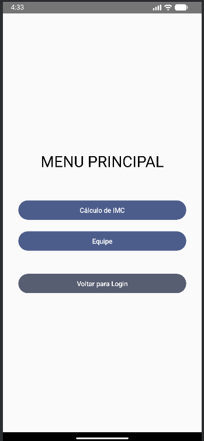

# GS 2 - Android Kotlin Developer (Jetpack Compose)

## Título do Projeto: Calculadora de IMC e Navegação

[cite_start]Este projeto foi desenvolvido utilizando **Kotlin** e **Jetpack Compose** (conforme requisito [cite: 21][cite_start]) para a Global Solution (GS 2025 - 3SIS - 2º Semestre [cite: 1]).

O aplicativo implementa a navegação entre quatro telas principais (Login, Menu, Cálculo de IMC e Equipe) e realiza o cálculo do Índice de Massa Corporal (IMC) do usuário.

---

## [cite_start]🧑‍🤝‍🧑 Integrantes da Equipe [cite: 46]

| Nome Completo | RM |
| :--- | :--- |
| **Matheus da Silva Cerqueira** | **99996** |
| **Gabriel Fernando Gimenez** | **92957** |

---

## 🛠️ Detalhes da Implementação

[cite_start]**Tecnologia:** Jetpack Compose (Kotlin) [cite: 21, 2]
**Navegação:** Navigation Compose

### Requisitos Atendidos:

* [cite_start]**Validação de Login:** Usuário `admin` [cite: 25] [cite_start]e Senha `123456`[cite: 26].
* [cite_start]**Cálculo de IMC:** A tela deve efetuar o cálculo de IMC, exibir o resultado IMC e o nome da pessoa[cite: 38, 37].
* [cite_start]**Fluxo de Navegação:** Implementado conforme o diagrama (Login -> Menu -> IMC / Equipe -> Login)[cite: 47].

---

## [cite_start]🖼️ Telas do Aplicativo (Evidências) [cite: 45]

### 1. Tela de Login
*Prova da validação das credenciais (`admin` / `123456`).*

### 2. Tela de Menu
*Prova da navegação principal.*

### 3. Tela de Cálculo de IMC (Resultado)
*Prova do cálculo e da exibição do Nome e IMC.*

### 4. Tela de Equipe
*Prova da lista de integrantes da equipe.*
